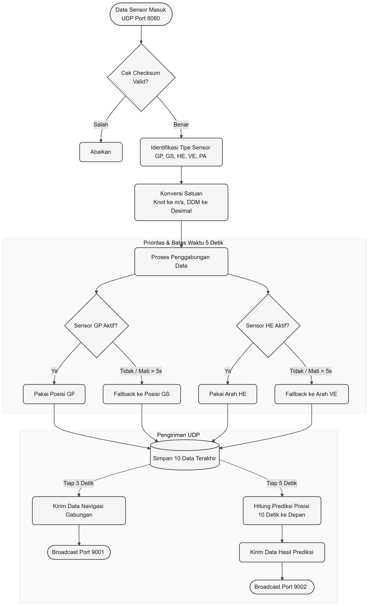
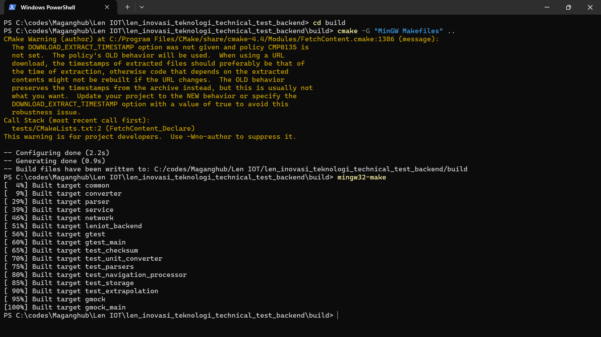
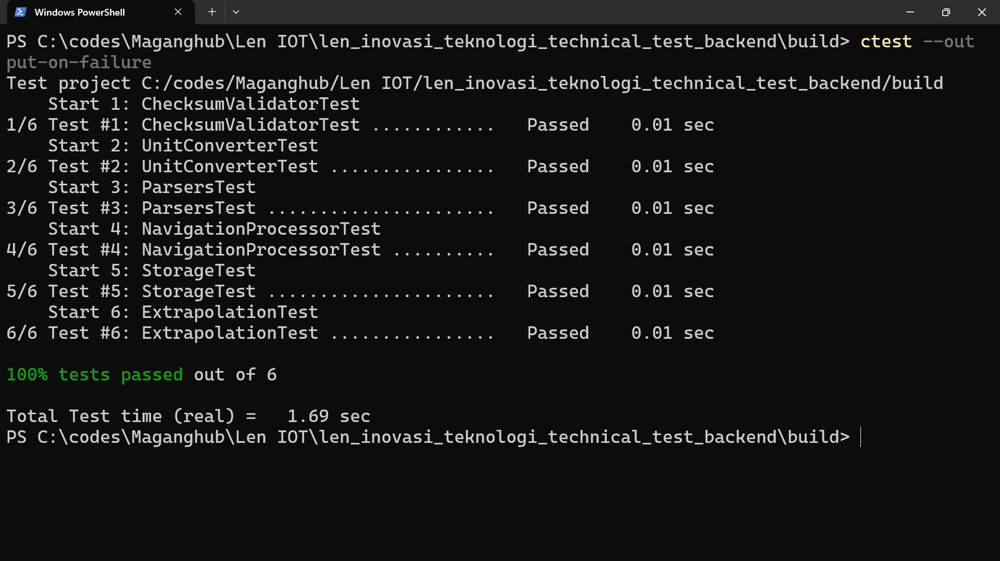

# LENIOT Backend Service

Backend service C++17 untuk memproses data sensor kapal (NMEA-like), menggabungkan data navigasi berdasarkan prioritas, dan melakukan ekstrapolasi posisi melalui UDP.

## Ringkasan

- **Requirement Understanding**:
  Menerima stream UDP (port 8080), validasi checksum XOR, standardisasi satuan ke SI, fusi data sensor dengan prioritas & expiry timeout, penyimpanan 10 data terakhir, serta broadcast data navigasi (port 9001, interval 3s) dan hasil prediksi ekstrapolasi (port 9002, interval 5s).

- **Algoritma**:
  - **Checksum**: Bitwise XOR karakter antara `$` dan `*`. Reject string kosong / malformed.
  - **Priority & Fallback**: Posisi diprioritaskan dari sensor `GP` dibanding `GS`. Jika `GP` tidak update > 5 detik, otomatis fallback ke `GS`. Begitu juga Heading (`HE` > `VE`).
  - **Ekstrapolasi**: Memperkirakan koordinat posisi kapal (lat/lon) untuk 10 detik ke depan berdasarkan posisi terakhir, arah hadap (heading), dan kecepatan saat ini ($jarak = kecepatan \times waktu$).
  - **Ring Buffer**: Penyimpanan riwayat navigasi kapasitas tetap (10 item) dengan operasi $O(1)$ (`std::deque` + `pop_front`).

### Diagram Alur


## Proses Implementasi

Proyek dibangun secara bertahap, antara lain:

1. **Setup & Infrastruktur (`feature/01`, `feature/02`)**
   - Inisialisasi struktur proyek CMake dan integrasi GoogleTest.
   - Pembuatan tipe data model (`GpData`, `GsData`, `NavigationData`, dll).

2. **Parsing & Validasi (`feature/03`, `feature/05`)**
   - Implementasi `ChecksumValidator` dengan operasi bitwise XOR antara `$` dan `*`.
   - Pembuatan `ILeniotParser` dan 5 parser spesifik untuk kalimat GP, GS, HE, VE, dan PA.
   - Implementasi Factory Pattern (`LeniotParserFactory`) untuk identifikasi tipe string masuk.

3. **Logika Inti (`feature/04`, `feature/06`)**
   - `UnitConverter` untuk konversi satuan (Knot ke m/s, DDM ke desimal, dsb).
   - `NavigationProcessor` untuk menggabungkan data dari sensor dengan logika prioritas fallback (misal: posisi dari GP > GS) dan validasi waktu kedaluwarsa.

4. **Penyimpanan & Ekstrapolasi (`feature/07`, `feature/08`)**
   - `StorageService` berupa Ring Buffer (`std::deque`) yang di-lock dengan Mutex, menyimpan maksimal 10 record terakhir secara thread-safe.
   - `ExtrapolationService` untuk memperkirakan posisi kapal 10 detik ke depan berdasarkan posisi terakhir, heading, dan kecepatan relatif.

5. **Networking & Integrasi (`feature/09`, `feature/10`)**
   - `UdpReceiver` dan `UdpSender` lintas platform (Winsock2 / POSIX).
   - Threading UDP: 1 thread receiver di `8080`, 1 thread pengirim navigasi (setiap 3 detik ke `9001`), dan 1 thread pengirim ekstrapolasi (setiap 5 detik ke `9002`).
   
## Build

Persyaratan: CMake dan compiler C++ (MinGW / GCC atau MSVC).

```bash
mkdir build
cd build

# Jika menggunakan MinGW:
cmake -G "MinGW Makefiles" ..
mingw32-make

# Jika menggunakan MSVC:
cmake ..
cmake --build .
```



### Opsi Docker
Aplikasi sudah dilengkapi dengan `Dockerfile`:
```bash
# Build image
docker build -t leniot-backend .

# Jalankan container
docker run -d -p 8080:8080/udp -p 9001:9001/udp -p 9002:9002/udp --name leniot leniot-backend

# Atau Docker Compose
docker compose up -d
```

---

## Pengujian

### 1. Unit Test
Jalankan dari folder `build`:
```powershell
ctest --output-on-failure
# atau langsung jalankan binary test:
Get-ChildItem tests\*.exe | ForEach-Object { & $_.FullName }
```



### 2. Jalankan Backend & Simulasi UDP
1. **Jalankan backend service** (di folder `build`):
   ```powershell
   .\src\leniot_backend.exe
   ```
2. **Jalankan tester sensor** (terminal baru di root proyek):
   ```powershell
   python tester.py
   ```
   Script akan mengirim paket data dummy ke port 8080 dan mendengarkan data hasil fusi di port 9001 serta prediksi di port 9002.